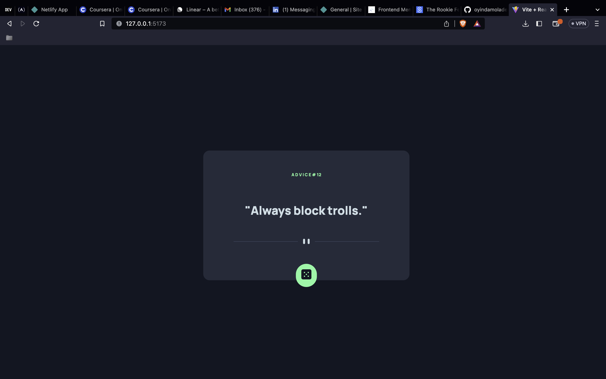

# Frontend Mentor - Advice generator app solution

This is a solution to the [Advice generator app challenge on Frontend Mentor](https://www.frontendmentor.io/challenges/advice-generator-app-QdUG-13db). Frontend Mentor challenges help you improve your coding skills by building realistic projects.


## Overview

### The challenge

Users should be able to:

- View the optimal layout for the app depending on their device's screen size
- See hover states for all interactive elements on the page
- Generate a new piece of advice by clicking the dice icon

### Screenshot




### Links

- Solution URL: (https://github.com/oyindamoladekeye/advice-generator)
- Live Site URL: (https://oyinda-advice-generator.netlify.app/)

## My process

### Built with
- Flexbox
- [React](https://reactjs.org/) - JS library

### What I learned
I'm proud of this codes, 
This helped me to learn more on https request and how to get data using axios library
I used GET request
```js
  const [adviceId, setAdviceId] = useState("1");
  const [advice , setAdvice] = useState("Take a leap");
   const fetchId = ()=>{
    axios.get("https://api.adviceslip.com/advice")
    .then((res)=>{
      console.log(res.data);
      setAdviceId(res.data.slip.id)
    })
  }
   const fetchAdvice =()=>{
    axios.get("	https://api.adviceslip.com/advice")
    .then((res)=>{
      console.log(res.data);
      setAdvice(res.data.slip.advice)
    })
   }

   function handleClicks(){
    fetchAdvice();
    fetchId();
   }
```


### Continued development

I want to learn more on axios and fetcing api
I am going to work on more projects to figure that out

### Useful resources

- [Example resource 1](https://dev.to/femi_dev/how-to-use-axios-with-react-5fom) - This helped me with axios. I really liked this pattern and will use it going forward.
## Author

- Frontend Mentor - [@oyindamoladekeye](https://www.frontendmentor.io/profile/oyindamoladekeye)
- Twitter - [@Pemisere16](https://www.twitter.com/Pemisere16)


